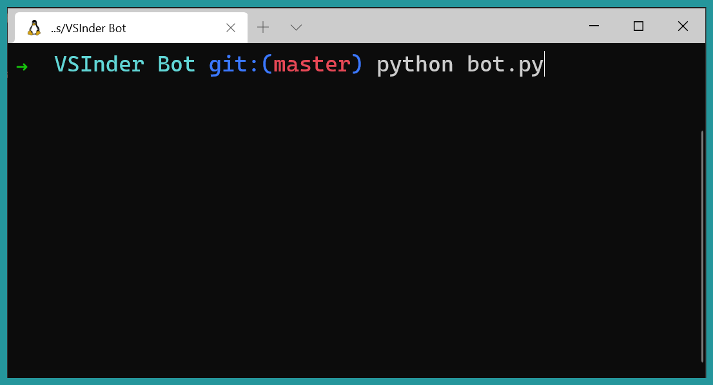

# [VSinder](https://github.com/benawad/vsinder) Bot

<a href="https://github.com/3n3a/vsinder_bot">
    
</a>

[VSinder](https://github.com/benawad/vsinder) Bot is a bot written for the [VSinder](https://github.com/benawad/vsinder) Dating Platform. It's built up from reverse engineering the API Calls the [VSinder](https://github.com/benawad/vsinder) App makes in iOS.

* Supports swiping on people
* Displaying Users Info
* Messaging your Matches

<p align="center">
  
</p>

## Why should you use [VSinder](https://github.com/benawad/vsinder) Bot

The answer is very simple, because it makes using [VSinder](https://github.com/benawad/vsinder) so much easier :). Imagine you have work but you don't want your programmer dating life to stop, so what do you do? Well you reverse engineer [VSinder](https://github.com/benawad/vsinder), or at least part of it and make a bot that runs until there's nothing more to swipe.

## How It Works

1. [VSinder](https://github.com/benawad/vsinder) Bot has multiple functions for various endpoints of the [VSinder](https://github.com/benawad/vsinder) Api. With the `access-token`, `refresh_token` and the `cookie` taken from a network request to the Api, this bot can swipe right on all the people, or as in the example `bot.py` swipe right or left at random.

2. After getting a match, which happens pretty fast, [VSinder](https://github.com/benawad/vsinder) Bot sends all the users that haven't sent a message a _Hey There :)_.

3. You found love ... great!

## Usage

1. Clone this reposiory or [download](https://github.com/3n3a/vsinder_bot/archive/master.zip) it [here](https://github.com/3n3a/vsinder_bot/archive/master.zip). And run the following:

```bash
pip install -r requirements.txt
```

2. Use an Network Sniffer on iOS ([Charles Proxy (iOS)](https://apps.apple.com/app/charles-proxy/id1134218562#?platform=iphone), [Thor](https://apps.apple.com/us/app/thor-http-sniffer-capture/id1210562295), [Stream (FREE)](https://apps.apple.com/us/app/stream-network-debug-tool/id1312141691)) to capture the `access-token`, `refresh_token` and the `cookie`.

3. Input the `access-token`, `refresh_token` and the `cookie` into the `bot.py` script and run it!

```bash
python bot.py
```

## Credits

Without [@benawad](https://github.com/benawad) this project wouldn't even exist, because without having [[VSinder](https://github.com/benawad/vsinder)](https://github.com/benawad/vsinder) what's the purpose of having a bot for it?!

## Disclaimer

Developers or anyone associated with this Repository assume no liablity and they are not responsible for how you use this tool.
Please use this tool for educational purpose only.

## Author

Enea Krähenbühl, 2021, [Personal Website](https://3n3a.ch), [GitHub](https://github.com/3n3a)

<a align="center" href="https://3n3a.ch">
  
</a>